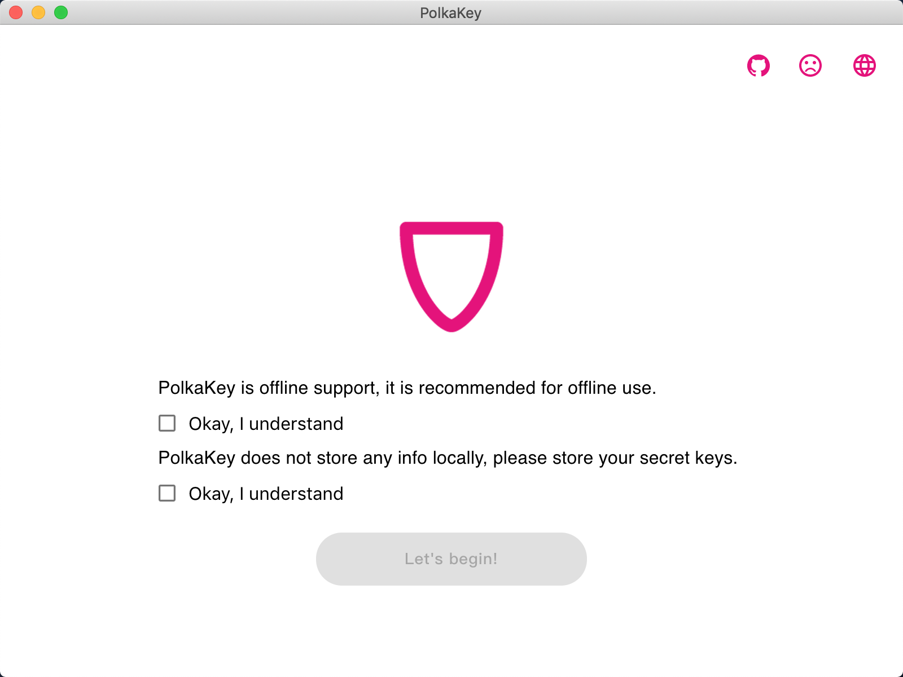
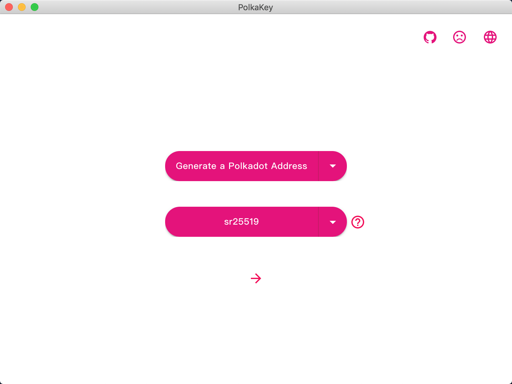
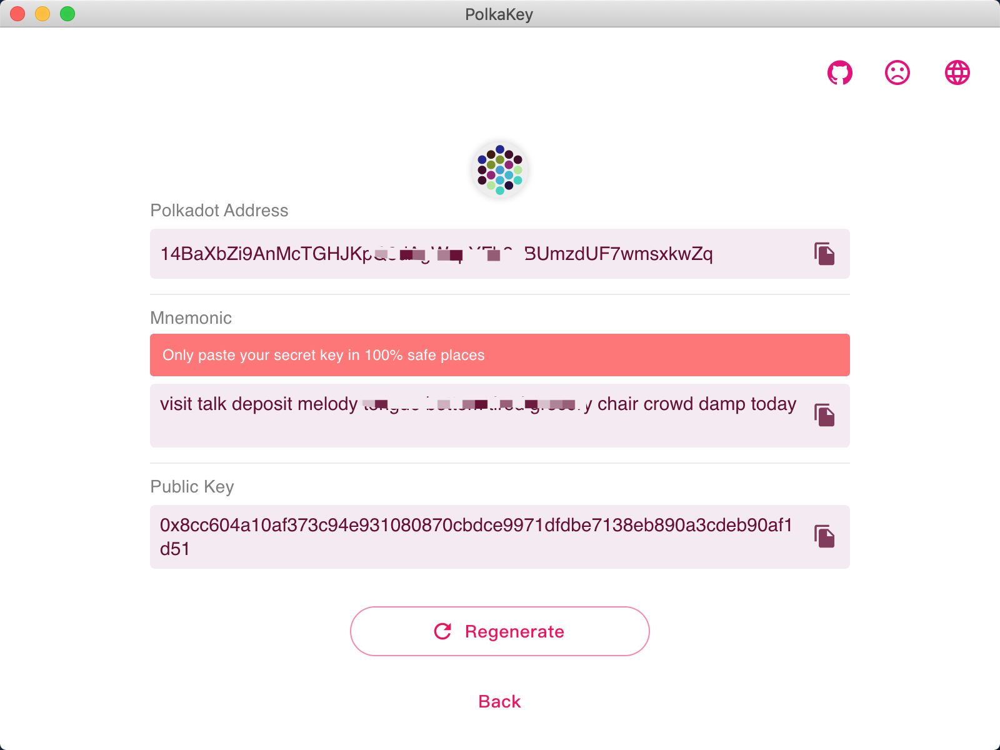

## UI for showcase

- When users open the App, they will see this page. We have reminded users that they can use PolkaKey offline, and PolkaKey will not save any data locally. After agreeing to these two points, they can take the next step.

- There are three buttons at the top, click on the first users can view PolkaKey source code on GitHub, and the second button represents the current network status of the computer. When the computer is online, it is a cry expression, when the computer is offline, it is a happy expression. The third button switch languages when clicked.

- On this page, the user can choose what kind of account they want to create and what cryptography will be used to create this account. Currently, Polkadot and Kusama addresses are supported, and we recommend that users use the default sr25519 type, thanks to @Jaco Greeff. [https://github.com/polkadot-js/apps/issues/2340](https://github.com/polkadot-js/apps/issues/2340)

- If you are not satisfied with the generated address, you can click regenerate, or go back to the previous page and choose to create another type of address.

### Note

At present, the App supports Auto-Update on Windows and Linux. See the section about [Auto-Update](https://www.electron.build/auto-update) for more information.

## Download

See <https://github.com/w3finance/PolkaKey/releases>. You will find the binaries there.

